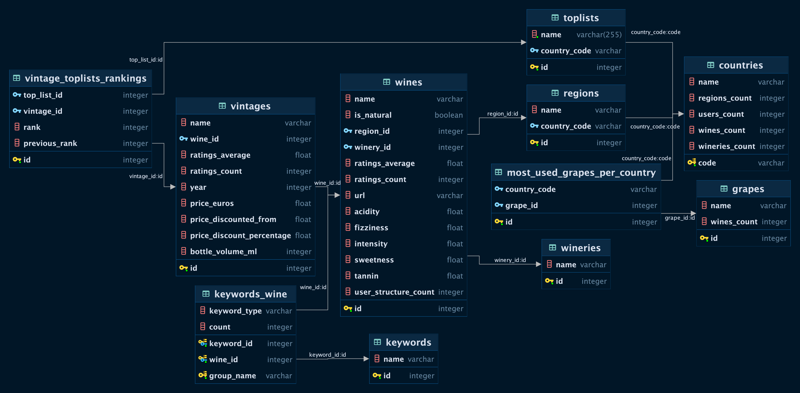

# Wine market analysis with Vivino database! :chart_with_upwards_trend: :wine_glass: 

## Introduction
Wine plays a significant role in the alcohol market. It encompasses a wide range of types, from mass-produced to luxury varieties. Each country has its unique wine-related traditions and preferences. To enhance marketing campaigns and boost sales for large wholesale companies, utilizing databases is essential across all countries. 
In this project, we attempt to answer a range of wine business questions using the database that comprises data from a large wine retail website.
This is a learning project aimed at consolidating SQL knowledge and Tableau visualization skills and was a part of BeCode Data and AI training. 

## Project Description

In this project, a range of questions of a wholesale wine company were answered:
1. Which 10 wines the company needs to highlight to increase the sales?
2. Which wine exporting country should the company prioritise due to the limited marketing budget for this year?
3. Which wineries should we award and why?
4. What wines can be described by the following taste: *coffee, toast, green apple, cream, citrus*?
5. What are the top 3 most common grapes all over the world, and what are the 5 best-rated wines for each type?
6. Create a visual leaderboard for the average wine and vintage rating in each country.
7. Which wines should the company recommend to a VIP client who likes Cabernet Sauvignon?

## Timeline
The project has been done in 5 days.
- Day 1 - Studying Tableau
- Day 2 and 3 - Creating the SQL queries.
- Day 4 - Visualization in Tableau.
- Day 5 - Organization of the files, preparation of the presentation and compiling the dashboard. 

## Technologies Used
To answer the questions of the client, the data analysts team has used:

- SQL for database management and queries.
- Tableau for data visualization.

## Installation
Install the packages from the ```requirements.py``` file. Additionally, to interact with the visuals, install Tableau Desktop or use Tableau Public.

## Database structure

 

## SQL Queries
The SQL Queries used in the project to answer the questions can be found in the ```sql_answers.ipynb``` file.
The ```presentation.pdf``` file contains the explanation and presentation.


## Authors
This project was created by [Ariana Bik](https://www.linkedin.com/in/ariana-bik-62213a107/), [Fabienne Thüer](https://www.linkedin.com/in/fabienne-th%C3%BCer-56a8a0a/), [Yanina Andriienko](https://www.linkedin.com/in/yanina-andriienko-7a2984287/), [Alfiya Khabibullina](https://www.linkedin.com/in/alfiya-khabibullina-7b13131b8/), under the supervision of the coach [Vanessa Rivera Quiñones](https://www.linkedin.com/in/vriveraq/).

Shall you have any questions or suggestions, please contact the authors via LinkedIn.